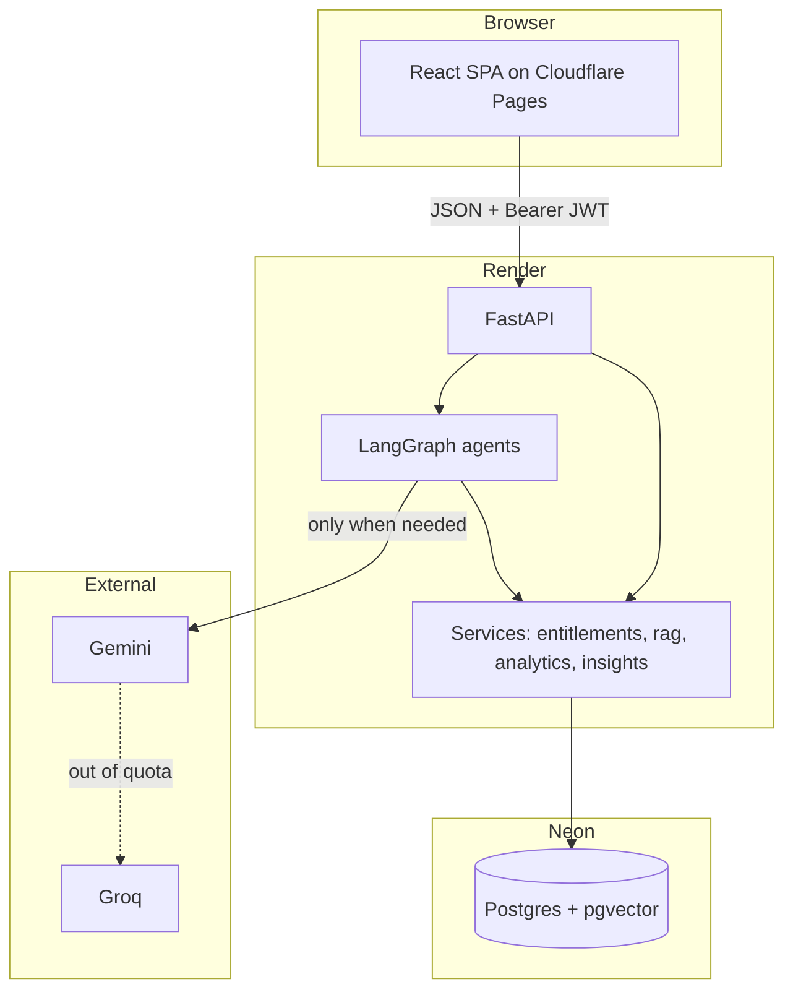

# Explanation: the tech, the decisions, and how to talk about them

This document is for interviews, your resume, and any moment where someone asks "so what did
you build?"

The other two documents explain **how** the code works. This one explains **why it is the way
it is**, and how to say that out loud without rambling.

---

## 1. The one-line version

> Master GYM is a gym management platform with three roles and an AI assistant. What a member
> can do — and what the assistant is allowed to tell them — is decided by the package they
> bought, and enforced on the server. It runs entirely on free tiers.

If you only get one sentence, use that one. The interesting part is not "I built a chatbot".
It is **the assistant is under the same permission system as the rest of the app.**

---

## 2. The problem it solves

A small gym runs on WhatsApp messages and a paper register. Three things go wrong:

1. **The front desk answers the same four questions all day.** Prices, timings, what is
   included, when does my plan expire.
2. **Nobody knows what a member paid for.** A member on a basic plan asks for a diet chart and
   sometimes gets one, because the rule lives in a person's memory rather than in a system.
3. **The owner has no idea what is happening.** Who is about to leave? Which class is empty?
   Which trainer is overloaded? The data exists but nobody queries it.

Master GYM answers all three: a chat assistant for the repeated questions, one server-side
rule engine for what each package allows, and admin agents (analyst, advisor, Copilot) that read
the database and report in plain English.

---

## 3. The full tech list

### Backend

| Tech | Used for | Chosen because |
| --- | --- | --- |
| **Python 3.11+** | Language | The AI ecosystem lives here |
| **FastAPI** | Web framework | Type hints become validation and generated docs |
| **SQLAlchemy 2.0** | ORM | The same models run on SQLite and Postgres |
| **Pydantic v2 / pydantic-settings** | Validation and config | Bad requests are rejected before my code runs |
| **PostgreSQL + pgvector** | Database and vector search | Embeddings sit beside the data, so one query filters and ranks |
| **SQLite** | Local development | Zero setup for a new contributor |
| **LangGraph** | AI flow control | Each step is a named, testable node instead of one long function |
| **Google Gemini** | Text and embeddings | Generous free tier, good quality |
| **Groq (Llama 3.1 8B)** | Backup model | 14,400 free requests a day, no card |
| **PyMuPDF + Gemini vision** | PDF ingest | Text extract or OCR; tables + image summary/detail |
| **PyJWT** | Tokens | Stateless auth, no session table |
| **pwdlib + Argon2** | Password hashing | The current recommended algorithm |
| **pytest** | Tests | 193 of them, offline |
| **ruff** | Linting and imports | Fast, replaces several tools |
| **Uvicorn** | ASGI server | The standard FastAPI pairing |

### Frontend

| Tech | Used for | Chosen because |
| --- | --- | --- |
| **React 18** | UI | The app is forms and lists; React is plenty |
| **TypeScript (strict)** | Language | API types written once, checked everywhere |
| **Vite 6** | Build and dev server | Instant reload, and its proxy removes local CORS work |
| **React Router 6** | Routing | Nested routes let one guard protect a group of pages |
| **Tailwind CSS v4** | Styling | Design tokens in CSS, no config file, no UI library to fight |
| **lucide-react** | Icons | Tree-shakeable, one consistent set |
| **React Context** | Shared state | The only shared state is the current user |
| **Playwright** | Browser tests | 46 tests on real Chromium |

### Infrastructure

| Tech | Used for | Chosen because |
| --- | --- | --- |
| **Render** | Hosting the API | Free web service with a public HTTPS URL |
| **Cloudflare Pages** | Hosting the site | Static files on a CDN, unlimited bandwidth |
| **Neon** | Managed Postgres | Free tier with pgvector, survives redeploys |
| **GitHub** | Source and CI trigger | Both hosts deploy on push |
| **`render.yaml`** | Infrastructure as code | The service configures itself from the repo |

**Total monthly cost: zero.** That constraint shaped several designs, which turns out to be a
good interview topic rather than an apology.

---

## 4. The shape of the system



The dotted line is the point of the whole LLM layer: when Gemini refuses, Groq answers, and
the member never finds out.

---

## 5. The six decisions worth talking about

These are the answers to "tell me about a technical decision you made". Each one has a
problem, the options, the choice, and the result. Pick two or three and know them properly
rather than mentioning all six.

---

### Decision 1: The AI reads the same permission rules as everything else

**The problem.** A member on a gym-only package asks FitBot about MMA training. If the
assistant answers from the gym's paid MMA material, the package tier means nothing and there
is no reason to upgrade.

**The options.**

1. A second list in the AI code saying which tier may read which documents.
2. Let the model decide from a system prompt.
3. Reuse the column that already defines the package.

**The choice.** Option 3. `allowed_disciplines` on the plan drives three things: which classes
you may book, which document shelves FitBot may quote, and which upgrade prompt you see.

**Why the others are worse.** A second list is a bug waiting to happen — the day someone adds
a tier, they update one list and not the other, and a paid feature quietly leaks. Trusting the
prompt is not a permission system at all; it is a polite request to a model that can be talked
out of things.

**The result.** Selling a tier and unlocking its material cannot drift apart, because there is
only one list. And the filter runs in the SQL `WHERE` clause, before ranking, so an excluded
document is never even a candidate. Retrieve is **hybrid** (keyword token overlap + semantic
cosine ranking, fused with RRF), still filtered in SQL first:

```python
# Both legs already restricted to KnowledgeChunk.discipline.in_(allowed)
keyword_hits = keyword_rank(query, allowed)
semantic_hits = semantic_rank(query, allowed)  # cosine_distance / HNSW on Postgres
fused = rrf_fuse([keyword_hits, semantic_hits], limit)
```

Filtering after ranking would let an excluded document influence which chunks came back. This
way it cannot.

**The nice part.** Ask about MMA on a gym package and FitBot does not refuse. It answers from
general knowledge and then names the package that unlocks the gym's own material. The
permission boundary became a sales feature.

---

### Decision 2: The admin agents do not write SQL

**The problem.** The owner wants to ask "how much revenue have we made?" and "who is about to
leave?" in plain English.

**The obvious answer.** Text-to-SQL. Give the model the schema and let it query.

**Why I did not.** Two reasons, and both are the kind of thing an interviewer wants to hear
someone think about unprompted:

1. **Security.** A model with SQL access to this database could read `users.password_hash` or
   members' private chat transcripts. One prompt injection in an uploaded PDF and it might.
2. **Trust.** A hallucinated join returns a confident wrong number that looks exactly as
   authoritative as a correct one. Nobody catches it, and the owner makes a decision on it.

**The choice.** A registry of eleven vetted metric queries. The model picks metric **keys**;
anything not in the registry is dropped before execution. Every number is computed by real
SQLAlchemy code. The model's only job is to explain figures it did not produce.

**The result.** A hallucinated key like `drop_all_users` simply does nothing. And there is a
free bonus: when the model is unavailable, keyword matching picks the keys instead, so the
agent still works with no API key at all. The recommendation engine works the same way —
findings are computed, and only the written summary needs a model.

**The line to use:** *"I gave it a menu instead of a kitchen."*

---

### Decision 3: The chatbot never asks for a password

**The problem.** A signed-out visitor asks "when does my plan expire?". The assistant needs to
know who they are.

**The lazy version.** Ask for their email and password in the chat.

**Why that is bad.** Two separate harms. Technically, the password would be written into
`chat_messages` and then resent to the model as conversation history on later turns. Socially,
it teaches users that a chatbot may legitimately ask for credentials, which is exactly the
habit phishing relies on.

**The choice.** The backend returns `action: "login"` and the widget renders a real form
inside the chat panel. It calls the same `signIn` in the auth context that the login page
uses. Credentials never become chat messages.

**The result.** The conversation is not interrupted — after signing in, the visitor's
conversation is adopted (`conversation.user_id = user.id`) and they can just ask again. The
system prompt also states plainly: never ask for a password, OTP or card number.

---

### Decision 4: Safety is checked before the model, not by it

**The problem.** Someone asks FitBot about chest pain during exercise, or which steroid to
take.

**The choice.** The first node in the graph is a keyword gate. A match returns a fixed referral
message, flags the conversation for a human trainer, and ends the graph. **The model is never
called.**

**Why a branch instead of a prompt instruction.** You cannot prompt-inject your way past a
code path that does not exist. "Ignore previous instructions" works on a system prompt; it does
not work on an `if` statement that returns before the API call. And the answer is identical
every time, which for a health question is the whole requirement.

**The honest weakness, which you should volunteer.** Keyword matching is blunt. It will
sometimes stop a harmless question that happens to contain "injury". For a health topic, that
is the correct direction to be wrong in — a false referral costs a mild annoyance, a false
answer costs somebody's back. It also only covers English and common Hinglish spellings, which
is a real gap.

**The result.** The safety path is also the easiest thing in the app to test, because it is a
pure function. `test_workflow.py` asserts it directly with no HTTP and no model.

---

### Decision 5: Designing for a free tier that runs out

**The problem.** Free LLM quotas are small. A chatbot that stops working at lunchtime is not a
product.

**Four things, in order of how much they helped.**

1. **Do not call the model when the database has the answer.** Prices and class timings live
   in `membership_plans` and `class_schedules`. These are the two most common questions a gym
   site gets, and they are read straight from Postgres. Instant, exact, zero quota. The model
   was told never to invent a price anyway, so it could not have answered well.

2. **Two providers in sequence.** Gemini first, then Groq. The daily ceiling becomes the sum of
   both rather than the smaller one. Groq's `llama-3.1-8b-instant` allows 14,400 requests a
   day free.

3. **A cooldown on an exhausted provider.** Once a provider reports its quota is gone it is
   skipped for 15 minutes. This is the fix that is easy to miss: without it, every later
   request would still try Gemini first and wait out its timeout before falling through, so the
   chat would technically work and feel broken.

4. **A prompt budget.** Retrieved chunks clipped from 1200 to 500 characters, at most three of
   them, a 1500-character context ceiling, four turns of history at 200 characters each, and
   fields the route cannot use left out entirely — membership details are irrelevant to a
   squat-technique question. That took a typical call from about 2,500 tokens to about 740.

**The result.** Three of the four never-touch-the-model paths (safety gate, triage, front desk)
plus the fallback chain mean FitBot keeps answering long after a single-provider build would
have stopped. Both API keys are optional: with neither, it explains what to configure.

**The framing to use:** *"A hard cost constraint forced better engineering than a budget
would have."* Caching, fallbacks and prompt trimming are exactly what you do at scale for money
reasons — the free tier just made them mandatory on day one.

---

### Decision 6: SQLite locally, Postgres in production, one codebase

**The problem.** Render's filesystem is ephemeral. Anything written to disk is gone on the next
deploy and every time the free instance wakes from sleep. The project started on SQLite and
ChromaDB, both of which are files on disk.

**The choice.** Move the database to Neon Postgres and the vectors from ChromaDB into pgvector
in that same database. After that, nothing the app cares about lives on disk, so a disposable
filesystem stops being a problem.

**Why pgvector rather than a vector database.** Keeping embeddings in the main database means a
search can filter by discipline **and** rank by similarity in one query — which is exactly
what Decision 1 needs. With a separate vector store you either fetch and filter afterwards, or
you duplicate permission data into the vector store's metadata and keep it in sync. It is also
one less service, one less free tier, one less thing to fail.

**The detail I would mention.** Neon suspends an idle database, so `db.py` sets
`pool_pre_ping=True`. A connection that died during the nap is detected and replaced rather
than throwing an error at whoever arrived first. Small line, and the difference between "the
demo is broken" and "the demo works".

**The result.** `python -m uvicorn app.main:app --reload` with no configuration still works on
SQLite for a new contributor. Vector search is the one feature that needs Postgres, and it
degrades to "answer without documents" rather than crashing.

---

## 6. Numbers you can quote

Have these ready. Specifics make a project sound real.

| Fact | Number |
| --- | --- |
| Backend tests, all offline | **193** |
| Playwright browser tests | **46** |
| Total automated tests | **232** |
| Database tables | **12** |
| API endpoints | **35** (including the health check) |
| LangGraph agents | **4** (FitBot, DataAgent, AdvisorAgent, Copilot) |
| MCP servers | **2** (gym tools + admin Copilot) |
| Vetted admin metrics | **11** |
| Recommendation rules | **12** |
| Roles | **3**, enforced server-side |
| Agentic RAG attempts | **2** (1 retrieve + optional rewrite) |
| Embedding dimensions | **768** |
| Chunk size and overlap | **1200 / 180 characters** |
| Runtime frontend dependencies | **4** |
| Monthly hosting cost | **₹0** |

Two of these are the good ones. **"232 tests, none of which need the internet for the
backend suite"** answers "how do you know it works?". **"Agentic RAG with package filtering
inside SQL"** is a measured retrieval design with a before and after story.

---

## 7. Resume bullets

Pick four. Each one names a technology, an action and a result.

> **Master GYM — full-stack gym platform with an AI assistant**
> FastAPI · PostgreSQL + pgvector · LangGraph · Gemini/Groq · React · TypeScript · Tailwind
>
> - Built a role-based platform (member, trainer, admin) where feature access is derived from
>   one server-side entitlement engine, so package tiers govern class booking, personalised
>   programmes, and which documents the AI assistant may quote — from a single source of truth.
> - Designed a LangGraph FitBot with a deterministic safety gate and triage, then a
>   tool-calling respond step (pricing, timetable, entitlements, RAG); combined with a
>   Gemini→Groq fallback chain and quota cooldown on free-tier limits.
> - Built advanced RAG over admin-uploaded PDFs: scanned-vs-text ingest (OCR, tables with order
>   preserved, image summary + detail), hybrid keyword+semantic RRF retrieve, and an agentic
>   grade-and-retry loop — membership filtering stays inside SQL and never widens the shelf.
> - Shipped an admin Copilot that orchestrates DataAgent and AdvisorAgent, plus two MCP servers
>   (gym tools and admin-only Copilot with login → short-lived session token).
> - Admin analytics use a registry of vetted SQL queries instead of model-generated SQL,
>   eliminating both hallucinated figures and the risk of an LLM reading password hashes.
> - Wrote 239 automated tests — 193 pytest with the model stubbed, 46 Playwright on real
>   Chromium that also fail on any console error or 5xx response.
> - Deployed on free tiers end to end (Render, Cloudflare Pages, Neon) with a `render.yaml`
>   blueprint, migrating off disk-backed SQLite and ChromaDB to survive an ephemeral filesystem.

---

## 8. Telling the story out loud

### The 60-second version

> "Master GYM is a gym platform with three roles and an AI assistant called FitBot. The part I
> find most interesting is that the assistant is inside the permission system rather than
> beside it. What a member paid for decides which classes they can book **and** which of the
> gym's documents the AI is allowed to quote — both read the same database column.
>
> FitBot is a tool-calling agent after a hard safety gate: the model picks pricing, timetable
> or RAG tools instead of inventing facts. Document search is agentic — one relevance grade and
> at most one rewrite, still on the same package shelf. Admins get a Copilot that orchestrates
> DataAgent and AdvisorAgent, also exposed as an MCP server with login then a session token.
>
> It runs entirely on free tiers, which forced real engineering — two LLM providers in
> sequence, a cooldown when one runs out of quota, and vetted metric queries instead of
> text-to-SQL."

That is three decisions in a minute, with a reason each. Stop there and let them pick one.

### Answering "what was the hardest part?"

Do not say "learning LangGraph". Say this:

> "Deciding what the AI should **not** be allowed to do. It's easy to wire up a model and get
> impressive answers. The hard part was working out that retrieval had to be filtered inside
> the SQL query rather than after ranking, because filtering afterwards still lets an excluded
> document shape which chunks come back. Same instinct with the analytics agent — the model
> picks from a menu of queries instead of writing them. Most of the design work was drawing
> boundaries around the model, not prompting it."

### Answering "what would you do differently?"

Have a real answer. Vagueness reads as not having thought about it.

> "Three things. Alembic migrations from the start — right now tables are created on startup
> and adding a column means rebuilding the database, which is fine while data is disposable and
> not fine after that. Redis for rate limiting, because the counter is in process memory, so it
> is correct on one instance and wrong on two. And streaming the chat responses; the model
> supports it and the reply currently arrives all at once, which makes a good answer feel slow."

### The 5-minute live demo

Order matters. Each step should show something the previous one could not.

1. **Landing page, then ask FitBot "what packages do you have?"** — the answer is instant.
   Explain why: it came from Postgres, not the model. No quota spent, and the price is exact.
2. **Ask "when does my plan expire?" while signed out** — a sign-in form appears inside the
   chat. Explain that it never asks for a password as a message, and why that matters.
3. **Sign in with the demo member and ask about MMA training** — it answers helpfully, then
   mentions the package that unlocks the gym's own material. That is the entitlement system
   showing up inside a conversation.
4. **Ask about chest pain during exercise** — a referral and a "flagged for a human trainer"
   badge. Note that the model was never called.
5. **Sign in as admin → Insights → Copilot → "why might members be leaving and what should I
   do?"** — shows agents used (DataAgent + AdvisorAgent). Explain the orchestrator.
6. **Advisor tab** — prioritised recommendations with evidence. Note findings are computed.

If you have seven minutes, add uploading a PDF (text or scanned), asking FitBot about it
(hybrid + agentic RAG / citation),
and a quick note that admin Copilot is also available as MCP with login → session token.

---

## 9. Questions you will be asked

**"Why LangGraph and not just a few if-statements or LangChain?"**
The value is that each step is a named node with explicit edges, so `safety_gate`, `triage`
and `respond` are separately testable pure functions — `test_workflow.py` calls them directly
with no HTTP and no model. The graph also documents itself: you can see at a glance that two
of the three paths never reach the model. LangChain's chains are more about composing calls;
here the interesting logic is the branching.

**"Is JWT in localStorage not insecure?"**
It is weaker against XSS than an httpOnly cookie, yes. The alternative needed CSRF protection
and cross-domain cookie handling between Cloudflare Pages and Render. I took the trade
knowingly, and reduced the blast radius: 8-hour expiry, the role claim is never trusted (the
server re-reads `user.role` from the database on every request, so a demotion takes effect
immediately), and any 401 clears the token. For a production app with real payment data I
would move to httpOnly cookies with a refresh token.

**"How do you stop prompt injection?"**
Mostly by not giving the model anything dangerous to do. It has no SQL access, no write
access, and no tools. The worst a poisoned PDF can do is influence the wording of one answer —
it cannot read another member's data, because retrieval is filtered by the caller's package in
the query itself. The safety gate runs before the model, so it cannot be argued with.

**"What happens when Gemini is down?"**
Groq answers. If both refuse, the chain returns a short apology rather than raising, so the
request still returns 200 with a sensible message. If neither key is configured, FitBot
explains what to add. Retrieval failures are also caught — answering without documents is much
better than a 500.

**"How would this handle 10,000 members?"**
Four things would need to change, roughly in this order. Rate limiting moves to Redis, because
the in-process counter is wrong the moment there are two instances. Payments become a real
provider callback instead of the simulated purchase. Alembic replaces create-on-startup.
And the analytics queries get indexes and caching — they are correct but they scan, which is
fine at hundreds of rows and not at millions. The pgvector HNSW index is already in place, so
retrieval scales further than the rest.

**"What did you not build?"**
Payments are simulated — choosing a package activates it and no card details are collected
anywhere. There are no migrations. Chat is not streamed. There are no component-level frontend
tests, only end-to-end. And the safety screening is keyword based, so it is blunt and
English-first.

---

## 10. Skills this project actually demonstrates

Useful when matching yourself to a job description.

**Backend engineering** — REST API design, relational modelling with twelve related tables,
role-based access control, stateless auth with JWT and Argon2, rate limiting, dependency
injection, layered architecture with services that do not import from the API layer.

**AI engineering** — RAG end to end with an agentic retry loop, agent design with LangGraph
(tool-calling FitBot + multi-agent Copilot), MCP servers with admin session auth, prompt
budgeting, multi-provider fallback with cooldowns, and constraining a model's authority so
hallucinations cannot become wrong numbers or leaked data.

**Frontend engineering** — React with TypeScript in strict mode, routing with role guards,
context-based auth state, a typed API client as the single network boundary, and a small
design system built from tokens rather than a component library.

**Security thinking** — permission checks on the server with the client as UX only, the role
claim in the token deliberately not trusted, retrieval filtered in SQL before ranking, no SQL
generation by a model, credentials kept out of the chat transcript, and read-only demo accounts
so public passwords cannot damage a public deployment.

**Testing** — 232 tests across two suites, stubbing external providers so the backend suite is
fast and offline, testing permission boundaries and not just happy paths, and browser tests
that fail on console errors and 5xx responses rather than only on wrong clicks.

**Operations** — deploying across three hosts, infrastructure as code with `render.yaml`,
diagnosing and designing around an ephemeral filesystem, connection pooling against a database
that sleeps, cold-start handling in the UI, and CORS and SPA-routing configuration.

**Judgement** — which is the one they are really testing. Every decision above has a stated
alternative and a stated reason for rejecting it, and the limitations section exists. Being
able to say "here is what I chose, here is what I gave up, and here is what I would change"
is the difference between someone who followed a tutorial and someone who made decisions.

---

## 11. Where to read more

- [README.md](README.md) — what the project is and how to run it
- [backend/BACKEND.md](backend/BACKEND.md) — the server in detail: tables, endpoints, agents, RAG, tests
- [frontend/FRONTEND.md](frontend/FRONTEND.md) — the browser app in detail: routes, auth state, pages, widget
- [DEPLOYMENT_GUIDE.md](DEPLOYMENT_GUIDE.md) — deployment A to Z, including what can and cannot cost money
- [DEPLOYMENT.md](DEPLOYMENT.md) — the original record of how this project went live
