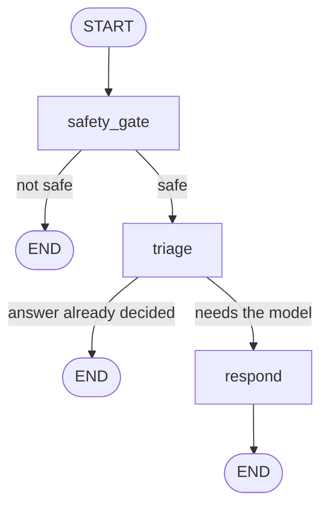
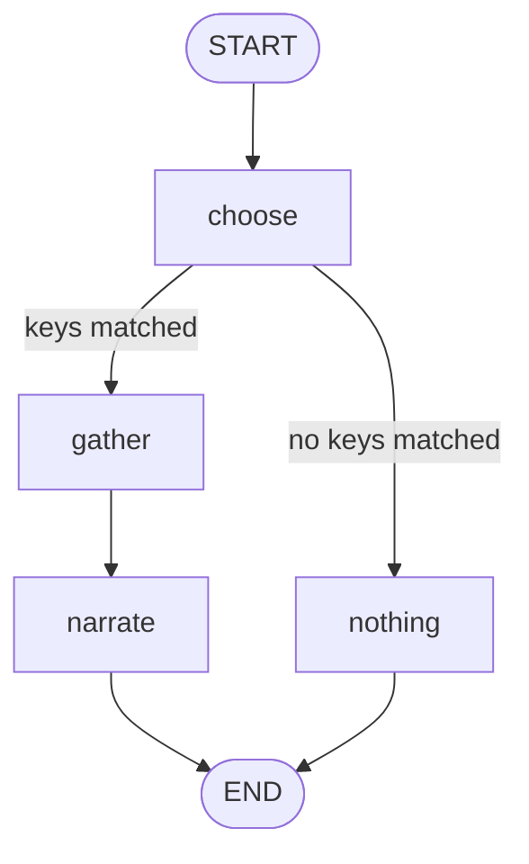
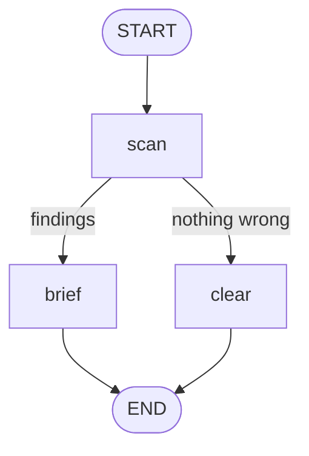

# Backend Guide

Everything about the server side of Master GYM: what each file does, how a request travels
through it, what the database looks like, and how the AI parts work.

Written in plain English. If you have never seen this codebase before, start at the top and
read down.

---

## 1. What the backend is

One FastAPI application. It does six jobs:

1. **Accounts** — sign up, sign in, and check who you are on every request.
2. **Money and rules** — sell packages, and decide what each package lets you do.
3. **Gym data** — classes, bookings, workout and diet programmes, trainer assignments.
4. **FitBot** — the chat assistant that answers members and visitors.
5. **Front desk** — secure QR passes, human-confirmed attendance and operational notices.
6. **Admin agents** — two tools that turn the database into plain-English answers and advice.

It runs on SQLite on your laptop and on Postgres when hosted. The code is the same in both
cases.

---

## 2. Tech used, and why

| Thing | Choice | Why this one |
| --- | --- | --- |
| Web framework | FastAPI | Type hints become validation and docs for free. `/docs` is generated. |
| Database toolkit | SQLAlchemy 2.0 | One set of models works on SQLite and Postgres. |
| Database | SQLite locally, Postgres (Neon) hosted | No setup to start, real database when live. |
| Vector search | pgvector | Embeddings live in the same database as the data, so one SQL query can filter *and* rank. |
| PDF reading | PyMuPDF + Gemini vision OCR | Text PDFs extract directly; scanned PDFs OCR via vision. |
| AI flow control | LangGraph | The steps of the chat are separate named nodes, so each one can be tested alone. |
| Text generation | Gemini first, Groq second | Two free tiers used in order last longer than one. |
| Embeddings | `gemini-embedding-001` at 768 dimensions | Free, and 768 keeps rows small. |
| Passwords | Argon2 through `pwdlib` | Argon2 is the current recommended password hash. |
| Tokens | `PyJWT` (HS256) | Small, stateless, no session table needed. |
| Settings | `pydantic-settings` | Reads `.env`, checks types, one place for defaults. |
| Tests | pytest | 207 tests, no network calls. |
| Linting | ruff | Fast, replaces flake8 + isort. |

Python 3.11 or newer. The hosted service pins 3.14.3 in `render.yaml`.

---

## 3. Folder map

```
backend/
├── pyproject.toml            Dependencies, pytest config, ruff config
├── .env.example              Template for your own .env
├── app/
│   ├── main.py               Builds the app, mounts routers, CORS, health check
│   ├── db.py                 All database tables + engine + session
│   ├── schemas.py            Pydantic models for requests and responses
│   ├── core/
│   │   ├── config.py         Every setting and its default
│   │   ├── security.py       Password hashing, JWT create/decode
│   │   └── rate_limit.py     Per-caller request limits
│   ├── api/
│   │   ├── deps.py           "Who is calling?" and role checks
│   │   ├── auth.py           Register, login, /me
│   │   ├── membership.py     Packages, purchase, classes, bookings
│   │   ├── people.py         Admin people management, profiles, programmes
│   │   ├── front_desk.py     QR passes, photos, attendance and notices
│   │   ├── fitbot.py         Chat JSON + SSE stream
│   │   ├── sse.py            Shared Server-Sent Event helpers
│   │   ├── knowledge.py      Admin PDF upload and delete
│   │   └── intelligence.py   DataAgent, AdvisorAgent, Copilot (+ SSE)
│   ├── agents/
│   │   ├── workflow.py       FitBot graph (safety → triage → tool-calling respond)
│   │   ├── tools.py          FitBot tool specs and executors
│   │   ├── analyst.py        DataAgent graph
│   │   ├── advisor.py        AdvisorAgent graph
│   │   └── orchestrator.py   Admin Copilot (supervisor over analyst + advisor)
│   ├── mcp_server.py         Public gym MCP tools (stdio)
│   ├── mcp_admin.py          Admin Copilot MCP (login → session token)
│   └── services/
│       ├── llm.py            Gemini → Groq fallback + generate_with_tools
│       ├── embeddings.py     Gemini embedding client
│       ├── pdf_extract.py    Scanned-vs-text detect, OCR, tables, image summary/detail
│       ├── rag.py            Ingest + hybrid (keyword + semantic RRF) retrieve
│       ├── gym_ops.py        Shared tools + agentic search_documents
│       ├── entitlements.py   What a package allows
│       ├── analytics.py      Vetted metric queries
│       ├── insights.py       Recommendation rules
│       └── front_desk.py     Price and timetable text from the database
├── scripts/
│   ├── seed.py               Create admin, --demo / --public-demo / --rich-demo datasets
│   └── reset_db.py           Drop schema, recreate packages, optional re-seed
└── tests/                    207 tests
```

The rule the layout follows: **`api/` handles HTTP, `services/` holds the thinking, `agents/`
wires the AI steps together, `db.py` owns storage.** A service never imports from `api/`.

---

## 4. How a request travels

Take `POST /api/fitbot/chat` as the example, because it touches almost everything.

```
Browser
  │
  ▼
CORS middleware              Is this origin allowed? (FRONTEND_ORIGIN)
  │
  ▼
rate_limit("chat", 20, 300)  Has this caller sent more than 20 messages in 5 minutes?
  │
  ▼
get_optional_user            Read the Bearer token. Valid? Load the user. No token? That is fine,
  │                          FitBot serves visitors too.
  ▼
get_db                       Open a SQLAlchemy session, close it when the response is done.
  │
  ▼
ChatRequest                  Pydantic checks the message is 1–4000 characters.
  │
  ▼
chat() in api/fitbot.py      Load or create the conversation, gather context, call the graph.
  │
  ▼
workflow.invoke(...)         LangGraph: safety_gate → triage → respond
  │
  ▼
ChatResponse                 Answer, route, sources, handoff flag, action.
```

Everything the graph needs is collected **before** the graph runs. The endpoint reads
entitlements, the fitness profile and the last few messages, then hands the graph a plain
dictionary. Prices, timetable and documents are fetched inside `respond` when the model
calls tools — that keeps the graph easy to test: no HTTP, no session mocking.

### The app itself (`app/main.py`)

- On startup a lifespan hook calls `initialize_database()`.
- `CORSMiddleware` allows the origins listed in `FRONTEND_ORIGIN` (comma-separated).
- All routers are mounted under `/api`.
- `GET /api/health` returns `{"status": "ok", "app": "Master GYM", "bot": "FitBot"}`.
- A catch-all exception handler returns a generic 500 message, so internal errors and stack
  traces never reach the browser.

---

## 5. Settings (`app/core/config.py`)

One `Settings` class read from environment variables or `.env`. Everything has a default, so
the app boots with no configuration at all.

| Setting | Default | Notes |
| --- | --- | --- |
| `APP_NAME` | `Master GYM` | |
| `BOT_NAME` | `FitBot` | |
| `ENVIRONMENT` | `development` | |
| `DATABASE_URL` | `sqlite:///./gym_coach.db` | SQLite paths are made absolute automatically |
| `JWT_SECRET` | dev placeholder | **Must** be replaced in production |
| `JWT_ALGORITHM` | `HS256` | |
| `ACCESS_TOKEN_EXPIRE_MINUTES` | `480` | 8 hours |
| `GEMINI_API_KEY` | none | Optional |
| `GEMINI_MODEL` | `gemini-3.5-flash` | Render uses `gemini-3.5-flash-lite` |
| `GEMINI_EMBEDDING_MODEL` | `gemini-embedding-001` | |
| `EMBEDDING_DIMENSIONS` | `768` | Must match the `Vector(768)` column |
| `GROQ_API_KEY` | none | Optional |
| `GROQ_MODEL` | `llama-3.1-8b-instant` | |
| `GROQ_BASE_URL` | `https://api.groq.com/openai/v1` | OpenAI-compatible |
| `LLM_TIMEOUT_SECONDS` | `20` | Fail fast so the fallback can run |
| `LLM_RETRY_ATTEMPTS` | `2` | |
| `LLM_MAX_OUTPUT_TOKENS` | `500` | Output counts against quota too |
| `LLM_COOLDOWN_SECONDS` | `900` | Skip an exhausted provider for 15 minutes |
| `DISPLAY_TIMEZONE` | `Asia/Kolkata` | Used when printing class times |
| `RATE_LIMIT_ENABLED` | `True` | |
| `CHAT_RATE_LIMIT` / window | `20` / `300` | |
| `LOGIN_RATE_LIMIT` / window | `10` / `300` | |
| `REGISTER_RATE_LIMIT` / window | `5` / `3600` | |
| `MAX_UPLOAD_MB` | `15` | |
| `FRONTEND_ORIGIN` | `http://localhost:5173` | Comma-separated list |
| `DEMO_ACCOUNT_EMAILS` | the three demo logins | Read-only accounts |

Two helper properties: `allowed_origins` splits the origin list, and `demo_emails` returns a
lowercased set for fast lookup.

---

## 6. The database (`app/db.py`)

### Engine and session

```python
is_sqlite = settings.database_url.startswith("sqlite")
connect_args = {"check_same_thread": False} if is_sqlite else {}
pool_args = {} if is_sqlite else {"pool_pre_ping": True, "pool_recycle": 300}
engine = create_engine(settings.database_url, connect_args=connect_args, **pool_args)
SessionLocal = sessionmaker(bind=engine, expire_on_commit=False)
```

Three details worth knowing:

- `postgresql://` is rewritten to `postgresql+psycopg://`, so you can paste Neon's connection
  string without editing it.
- `pool_pre_ping=True` matters because Neon puts an idle database to sleep. A connection that
  died during the nap is detected and replaced instead of raising an error.
- `expire_on_commit=False` means you can still read an object's fields after `commit()`.

`initialize_database()` runs on startup and does four things: enables the `vector` extension
(Postgres only), creates any missing tables, creates the HNSW index on the embedding column,
and seeds the three default packages if the plan table is empty.

### Tables

Sixteen tables. IDs are UUID4 strings, timestamps are naive UTC.

**`users`** — `id`, `email` (unique, indexed), `full_name`, `phone`, `password_hash`, `role`
(`member` / `trainer` / `reception` / `admin`), `active`, `created_at`.

**`membership_plans`** — the sellable packages. `name` (unique), `tier`, `duration_days`,
`price_paise`, `description`, `active`, plus the four columns that define what the package
actually gives:

- `allowed_disciplines` — comma-separated, e.g. `"gym,yoga"`
- `monthly_class_quota` — `-1` means unlimited
- `personalised_programme` — boolean
- `priority_support` — boolean

**`memberships`** — one row per purchase. `user_id`, `plan_id`, `starts_on`, `expires_on`,
`status`.

**`fitness_profiles`** — one row per member, primary key *is* `user_id`. Holds `goal`,
`experience_level`, `injuries_or_limits`, `preferred_domains`, `equipment_access`, and
`assigned_trainer_id`. FitBot reads this before coaching answers.

**`programmes`** — trainer-written plans. `member_id`, `trainer_id`, `kind` (`workout` or
`diet`), `title`, `content`, `active`.

**`class_schedules`** — `name`, `discipline`, `instructor`, `trainer_id`, `starts_at`,
`capacity` (default 20).

**`class_bookings`** — `class_id`, `member_id`, with a unique constraint
`uq_booking_once` on the pair, so double booking is impossible at the database level rather
than only in code.

**`member_passes`** and **`member_photos`** — one revocable signed QR pass and one optional
desk-verification photo per member. Only a pass digest is stored; the photo is shown to a human,
not processed as a biometric.

**`attendances`** — door check-ins with the member, reception/admin actor, method and UTC time.
Repeated confirmation inside four hours returns the existing row instead of creating a duplicate.

**`gym_notices`** — time-windowed repair, closure and information messages shown during check-in.

**`conversations`** and **`chat_messages`** — the chat transcript. `conversations.user_id` is
nullable because visitors chat too. `chat_messages.sources_json` stores the citations as JSON.

**`knowledge_documents`** — one row per uploaded PDF. `document_hash` is a SHA-256 of the file
and is unique, so uploading the same PDF twice is a no-op. `ingest_mode` is `direct` (selectable
text) or `ocr` (scanned pages via Gemini vision).

**`knowledge_chunks`** — the searchable pieces. `document_hash`, `source`, `page`,
`discipline` (indexed), `kind` (`text` | `table` | `image_summary` | `image_detail`),
`content`, and `embedding`. The embedding column is `Vector(768)` on Postgres and plain `Text`
on SQLite, which is why vector search only works when hosted.

On Postgres an approximate-nearest-neighbour index is created:

```sql
CREATE INDEX IF NOT EXISTS ix_knowledge_chunks_embedding
ON knowledge_chunks USING hnsw (embedding vector_cosine_ops)
```

**`audit_events`** — `actor_id`, `action` (indexed), `resource_type`, `resource_id`, `detail`.
Written on sensitive changes: registration, plan edits, purchases, role changes, analyst
questions.

---

## 7. Login and security

### Passwords

`app/core/security.py` uses `pwdlib`'s `PasswordHash.recommended()`, which is Argon2 today.
Two functions: `hash_password` and `verify_password`. The plain password is never stored and
never logged.

### Tokens

```python
def create_access_token(subject: str, role: str) -> str:
    expires_at = datetime.now(UTC) + timedelta(minutes=settings.access_token_expire_minutes)
    payload = {"sub": subject, "role": role, "exp": expires_at}
    return jwt.encode(payload, settings.jwt_secret, algorithm=settings.jwt_algorithm)
```

HS256, 8-hour expiry, three claims. The `role` claim is a convenience for the client only —
**the server never trusts it.** Every protected endpoint loads the user row from the database
and reads `user.role` from there. If an admin demotes someone, the change takes effect on the
next request, not when their old token expires.

### Who is calling (`app/api/deps.py`)

The chain is small on purpose:

```
HTTPBearer(auto_error=False)
   └── _user_from_credentials   decode the token, load the user, require user.active
         ├── get_current_user   401 if missing; also runs the demo-account guard
         ├── get_optional_user  returns None instead of raising (used by FitBot)
         └── require_roles(*roles)
               ├── require_admin = require_roles(ADMIN)
               ├── require_staff = require_roles(ADMIN, TRAINER)
               └── require_front_desk = require_roles(ADMIN, RECEPTION)
```

`auto_error=False` is what lets one endpoint serve both visitors and members: a missing header
is not an error, just an absent user. Reception is intentionally **not** in `require_staff`, so
desk accounts cannot write programmes or manage the timetable.

### The read-only demo accounts

The hosted site prints three shared logins on the sign-in page so a recruiter can look around
without signing up. Public passwords and a writable admin account do not mix, so those three
accounts are blocked from writing:

```python
WRITE_METHODS = {"POST", "PUT", "PATCH", "DELETE"}
DEMO_WRITE_PATHS = (
    "/api/admin/analyst/ask",
    "/api/admin/analyst/ask/stream",
    "/api/admin/copilot/ask",
    "/api/admin/copilot/ask/stream",
)
DEMO_WRITE_SUFFIXES = ("/book",)

def _guard_demo_account(user, request):
    if request.method not in WRITE_METHODS:
        return
    if not is_demo_account(user):
        return
    path = request.url.path
    if path in DEMO_WRITE_PATHS or path.endswith(DEMO_WRITE_SUFFIXES):
        return
    raise HTTPException(403, detail="This is a shared demo login...")
```

Two exceptions stay open because they are the interesting parts of the tour and neither
outlives the visit: asking the data agent a question, and booking a class. The check lives in
`get_current_user`, so it covers every current and future write endpoint automatically. The
admin people list also redacts other members' email addresses when the caller is the demo
admin.

### Rate limiting (`app/core/rate_limit.py`)

A sliding window kept in process memory, keyed on `(bucket, caller)`.

| Bucket | Limit | Window | Endpoint |
| --- | --- | --- | --- |
| `chat` | 20 | 5 minutes | `POST /api/fitbot/chat` or `/api/fitbot/chat/stream` |
| `login` | 10 | 5 minutes | `POST /api/auth/login` |
| `register` | 5 | 1 hour | `POST /api/auth/register` |

Going over returns **429** with a `Retry-After` header. The caller is the first entry of
`X-Forwarded-For` when present, because behind Render's proxy the socket address belongs to the
proxy, not the visitor. `MAX_TRACKED_CLIENTS = 20_000` caps memory use.

This is honest about its limit: one process, one counter. Two instances would each grant the
full allowance, so scaling out would need Redis.

---

## 8. Package rules (`app/services/entitlements.py`)

This is the single place that answers "what is this member allowed to do?". Tier is the thing
customers pay for, so the answer is computed on the server and never inferred from the UI.

`entitlements_for(db, user)` returns a frozen `Entitlements` dataclass:

- Admins and trainers get `STAFF_ENTITLEMENTS` — every discipline, unlimited classes.
- A member with no live membership gets `NO_MEMBERSHIP` — nothing allowed.
- Otherwise the fields are read off the plan they actually bought.

The useful method is `may_book`, which returns a decision *and* a sentence to show the member:

```python
def may_book(self, discipline: str) -> tuple[bool, str]:
    if not self.has_active_membership:
        return False, "You need an active membership to book classes."
    if discipline not in self.allowed_disciplines:
        return False, f"Your {self.plan_name} package does not include {discipline} classes. Upgrade to unlock them."
    if not self.can_book_classes:
        return False, f"You have used all {self.monthly_class_quota} class bookings included in {self.plan_name} this month."
    return True, ""
```

`allowed_disciplines` is reused in three places: booking permission, which document shelves
FitBot may quote, and the upgrade prompt. That is deliberate. Selling a tier and unlocking its
material cannot drift apart, because there is only one list.

---

## 9. The API surface

Everything is under `/api`.

### Auth — `app/api/auth.py`

| Method | Path | Who | What it does |
| --- | --- | --- | --- |
| POST | `/auth/register` | anyone (5/hour) | Creates a **member**, whatever the body says, and returns a token |
| POST | `/auth/login` | anyone (10/5min) | Returns a token. Same error text for wrong email and wrong password |
| GET | `/auth/me` | signed in | The current user |

Self-signup cannot create an admin. Role escalation through the request body is tested.

### Packages and classes — `app/api/membership.py`

| Method | Path | Who | What it does |
| --- | --- | --- | --- |
| GET | `/plans` | anyone | Active packages, cheapest first |
| POST | `/admin/plans` | admin | Create a package |
| PUT | `/admin/plans/{plan_id}` | admin | Edit a package |
| GET | `/me/entitlements` | signed in | What the caller may do |
| POST | `/me/membership` | signed in | Buy a package (payment is simulated) |
| GET | `/classes` | signed in | Upcoming classes with seat counts |
| POST | `/classes/{class_id}/book` | signed in | Book, after the entitlement, capacity and duplicate checks |
| DELETE | `/classes/{class_id}/book` | signed in | Cancel your own booking |
| POST | `/staff/classes` | admin or trainer | Add a class to the timetable |
| DELETE | `/staff/classes/{class_id}` | admin, or the trainer who owns it | Remove a class |

### Front desk — `app/api/front_desk.py`

Reception is a separate role with no trainer or admin privileges. Admin and reception can scan
or search for a member, read the live package/class/trainer/notices briefing, enroll the display
photo, rotate a lost pass and confirm attendance. Only admins write operational notices.

The browser decodes QR locally with ZXing and sends only the opaque token. The model is never
called; every briefing field is loaded from SQL.

| Method | Path | Who | What it does |
| --- | --- | --- | --- |
| GET | `/me/pass` | member | Issue or return the signed QR token for this member |
| POST | `/front-desk/lookup` | admin, reception | Resolve a scanned token → `FrontDeskBriefing` |
| POST | `/front-desk/check-in` | admin, reception | Confirm attendance (`qr` \| `manual`); 4-hour idempotent |
| GET | `/front-desk/search?q=` | admin, reception | Find up to 8 members by name / email / phone |
| GET | `/front-desk/briefing/{user_id}` | admin, reception | Same briefing without a scan |
| POST | `/staff/members/{id}/pass/rotate` | admin, reception | Revoke old pass, issue a new token |
| PUT | `/staff/members/{id}/photo` | admin, reception | Enroll JPEG/PNG ≤ 500 KB for human verification |
| GET | `/staff/members/{id}/photo` | admin, reception, or that member | Raw image bytes |
| GET | `/front-desk/notices` | admin, reception | List operational notices |
| POST / PUT / DELETE | `/front-desk/notices[/{id}]` | admin | Create, update or delete notices |

### People, profiles and programmes — `app/api/people.py`

| Method | Path | Who | What it does |
| --- | --- | --- | --- |
| GET | `/admin/people` | admin | Everyone, filterable by role |
| POST | `/admin/people` | admin | Create a member, trainer or reception account |
| PATCH | `/admin/people/{user_id}` | admin | Edit; cannot deactivate yourself |
| POST | `/admin/people/{user_id}/role` | admin | Change role (including `reception`); cannot change your own |
| POST | `/admin/people/{member_id}/trainer/{trainer_id}` | admin | Assign a trainer |
| GET | `/admin/overview` | admin | Counts, revenue, bookings |
| GET | `/trainer/members` | admin or trainer | Trainers see only their own members |
| POST | `/staff/programmes` | admin or trainer | Write a workout or diet plan |
| GET | `/staff/members/{member_id}/programmes` | admin or trainer | That member's plans |
| GET | `/me/profile` | signed in | Fitness profile, created on first read |
| PUT | `/me/profile` | signed in | Update it |
| GET | `/me/programmes` | signed in | Your active plans |

Two guards that are easy to forget and are both tested: an admin cannot remove their own admin
rights, and cannot deactivate their own account. Either one could lock the last admin out.

### FitBot — `app/api/fitbot.py`

| Method | Path | Who | What it does |
| --- | --- | --- | --- |
| POST | `/fitbot/chat` | anyone (20/5min) | Runs the graph, saves both messages |
| POST | `/fitbot/chat/stream` | anyone (20/5min) | Same turn as SSE: `meta`, progressive `token` chunks, then final metadata in `done` |
| GET | `/fitbot/conversations/{id}` | owner only | The transcript |

A stream sends `Cache-Control: no-cache, no-transform` and `X-Accel-Buffering: no` so hosting
proxies do not hold the chunks. The exchange is committed only after the complete answer has
been delivered; a failed stream rolls the transaction back. The JSON endpoint remains the
frontend's compatibility fallback.

A conversation started by a visitor is adopted when they sign in mid-chat:

```python
if user is not None and conversation.user_id is None:
    conversation.user_id = user.id
```

Once a conversation has an owner, nobody else can read it — including anonymous callers who
happen to know the ID.

### Knowledge base — `app/api/knowledge.py`

| Method | Path | Who | What it does |
| --- | --- | --- | --- |
| GET | `/admin/knowledge/documents` | admin | List ingested PDFs (`ingest_mode`, chunk counts) |
| POST | `/admin/knowledge/documents` | admin | Upload PDF (≤20 MB): classify direct vs OCR, extract text/tables/images, embed |
| DELETE | `/admin/knowledge/documents/{id}` | admin | Delete the document and its chunks |

Only admins touch this. Members never see documents directly; they only ever see FitBot's
answers.

### Admin agents — `app/api/intelligence.py`

| Method | Path | Who | What it does |
| --- | --- | --- | --- |
| GET | `/admin/analyst/metrics` | admin | Every metric in the registry |
| POST | `/admin/analyst/ask` | admin | Ask a question in plain English |
| POST | `/admin/analyst/ask/stream` | admin | Same answer as SSE (`token` + metric `done`) |
| GET | `/admin/advisor/report` | admin | Prioritised recommendations |
| GET | `/admin/advisor/report/stream` | admin | Briefing streamed; recommendations in `done` |
| POST | `/admin/copilot/ask` | admin | Supervisor: DataAgent and/or AdvisorAgent |
| POST | `/admin/copilot/ask/stream` | admin | Combined answer as SSE; tables/recs in `done` |

JSON endpoints stay as the UI fallback. Demo accounts may POST the ask and ask/stream paths.

Shared helpers live in `app/api/sse.py` (`sse`, `text_chunks`, `event_stream`). Events are
always `meta` → progressive `token` → `done` (or `error`). Structured payloads (metrics,
recommendations, FitBot sources) travel in `done`, not mid-stream.

---

## 10. FitBot (`app/agents/workflow.py`)

### The graph

Three nodes and two decision points:



The shape carries the main idea: **two of the three paths never call the model.** Only
`respond` costs quota. Safety and auth/upgrade prompts stay as code — those are permission
decisions, not something a prompt can be talked out of.

### Node 1 — `safety_gate`

Checks the message against `HIGH_RISK_TERMS` and `INJURY_TERMS`. A match returns a fixed
referral, sets `needs_human_handoff=True`, and ends the graph. The model is never called.

### Node 2 — `triage`

Decides whether the question can be answered at all, before spending a model call. In order:

1. **Signed-out and asking to join** → signup prompt, `action="signup"`.
2. **Signed-out and asking about "my plan" / booking / expire** → login prompt, `action="login"`.
3. **Signed in, asking for a personalised plan, package does not include it** → upgrade prompt.
4. **Otherwise** → set the route and continue to `respond`.

Prices and timetable are **not** short-circuited here anymore. The model calls `get_pricing` /
`get_timetable` tools instead, so the same path works for FitBot and MCP.

### Node 3 — `respond` (tool-calling agent)

```python
result = get_llm().generate_with_tools(
    SYSTEM_PROMPT, prompt, FITBOT_TOOLS,
    lambda name, arguments: execute_fitbot_tool(name, arguments, ctx),
)
```

Tools (see `app/agents/tools.py`, backed by `app/services/gym_ops.py`):

| Tool | Purpose |
| --- | --- |
| `get_pricing` | Live packages from Postgres |
| `get_timetable` | Next 7 days of classes |
| `search_knowledge` | Hybrid + agentic RAG, filtered by package |
| `check_entitlement` | Caller's plan / quota / expiry |
| `request_login` / `request_signup` | In-chat forms — never ask for a password |

Gemini and Groq both run a tool loop (max 4 rounds) with the same fallback/cooldown as plain
`generate`. If a provider has no tool API, the chain falls back to plain text generation.

### The prompt budget

History is still clipped (`HISTORY_TURNS` / `HISTORY_CHARS_PER_TURN` in the chat endpoint).
Documents arrive via tools rather than being stuffed into the first prompt, which keeps the
initial call small. Chunk text is clipped to 500 characters when rendered for the model.

---

## 11. The knowledge base (`pdf_extract.py` + `rag.py` + agentic layer in `gym_ops.py`)

### Ingesting a PDF

Admin-only: `POST /api/admin/knowledge/documents` with form fields `file` (PDF) and
`discipline` (`gym` | `yoga` | `mma` | `reception`).

1. Validate role, discipline, `.pdf` extension, and size (≤ 20 MB).
2. Write bytes to a temp file (discarded after ingest — nothing stays on the app disk).
3. SHA-256 the file; if any `knowledge_chunks` already have that hash, skip (dedup).
4. **Classify** (`pdf_extract.is_scanned_pdf`): average selectable chars/page &lt; 40 → scanned.
5. **Direct path** (text PDF):
   - Extract selectable text → 1200/180 chunks (`kind=text`).
   - Detect tables via PyMuPDF `find_tables` → markdown with row/column order (`kind=table`).
   - Extract embedded images → Gemini vision writes **both** a short `image_summary` and a
     longer `image_detail` passage (form cues + any readable labels).
6. **OCR path** (scanned PDF): render each page → Gemini vision OCR. Structured reply is split
   into text / markdown tables / `[IMAGE]` summary+detail. Requires `GEMINI_API_KEY`.
7. Embed every passage with Gemini (`768` dims). Embedding outage → `503`, nothing stored.
8. Insert `knowledge_chunks` (hash, source, page, discipline, **kind**, content, embedding).
9. Insert `knowledge_documents` (includes **ingest_mode**) + `knowledge.uploaded` audit row.

`initialize_database()` also `ALTER`s older DBs to add `ingest_mode` / `kind` if missing.

### Hybrid search (base retrieve)

Not semantic-only. `KnowledgeBase.retrieve`:

1. Filter by allowed disciplines in SQL (package shelf never widens).
2. **Keyword leg** — token overlap scoring over chunk text.
3. **Semantic leg** — `cosine_distance` / HNSW on embeddings (Postgres).
4. **Reciprocal Rank Fusion (RRF)** merges the two ranked lists (`k=60`).
5. Return top-N with `kind` so the model sees whether a hit is text, table, or image.

### Agentic RAG (`search_documents` in `gym_ops.py`)

Still wraps hybrid retrieve:

1. Retrieve on the requested shelf (package filter unchanged).
2. Locked shelf or empty shelf → stop. No judge call.
3. If chunks exist and an LLM is configured → grade with a tiny JSON judge
   `{"enough": bool, "rewrite": "..."}`.
4. If not enough and rewrite is set → **one** more hybrid retrieve on the **same** shelf
   (`MAX_RETRIEVAL_ATTEMPTS = 2`).
5. No LLM / unreadable JSON → keep the first pass.

FitBot's `search_knowledge` tool and the public MCP `search_knowledge` both call this helper,
so behaviour cannot drift.

### Who may read what

`readable_disciplines` adds `reception` to whatever the package allows — same ladder as before
(visitor → Starter → Performance → Complete → staff).

---

## 11b. Admin Copilot (`app/agents/orchestrator.py`)

A supervisor with two tools: `ask_data_analyst` and `get_advisor_report`. It may call one or
both, then narrate. When no LLM is configured, a keyword router still runs both specialists
where appropriate. Exposed as `POST /api/admin/copilot/ask` and as the admin MCP `ask_copilot`
tool after login.

---

## 11c. MCP servers

| Module | Entry | Tools |
| --- | --- | --- |
| `app/mcp_server.py` | `python -m app.mcp_server` / `master-gym-mcp` | pricing, timetable, knowledge, metrics, book class |
| `app/mcp_admin.py` | `python -m app.mcp_admin` / `master-gym-admin-mcp` | `admin_login`, `ask_copilot`, `admin_logout`, `sample_questions` |

Admin MCP: password only on `admin_login`; later calls use a short-lived JWT with
`purpose=mcp_admin`. Role is re-read from the DB every time. Wire these only on a machine you
own — not on a shared PC.

---

## 12. Surviving the free tier (`app/services/llm.py`)

A chatbot that stops working at lunchtime is not a product. Three mechanisms keep FitBot
answering.

**1. Two providers, in order.** `LLMChain` holds `[GeminiProvider(), GroqProvider()]` and asks
each in turn. Unconfigured providers are skipped, so the app works with one key, both, or
neither.

**2. A cooldown on exhausted providers.**

```python
except ProviderUnavailable as unavailable:
    if unavailable.exhausted:
        self._resume_at[provider.name] = time.monotonic() + self.cooldown_seconds
```

`exhausted` means a quota or rate-limit refusal — HTTP 429, or `RESOURCE_EXHAUSTED` in the
Gemini error. That is worth remembering, because a provider out of quota will refuse every
other caller too. Without the cooldown, all 900 following requests would each wait out
Gemini's timeout before falling through, and the chat would crawl. `get_llm()` is
`lru_cache`d so the cooldown is remembered across requests in the process.

**3. Fail fast.** The Gemini client is built with a 20-second deadline and 2 retries. The SDK's
default is to retry a rate-limited call for minutes while the chat window spins.

Failures degrade in steps rather than crashing: no keys configured returns a message telling
you to add one; every provider refusing returns a short apology. Neither raises.

Groq is called over plain `httpx` against its OpenAI-compatible endpoint rather than its SDK,
because the request is one JSON POST and `httpx` was already a dependency.

---

## 13. Answers that never touch the model (`app/services/front_desk.py`)

Prices and class timings are the two most common questions a gym website gets. Both are already
in the database, so they are read directly:

- `pricing(db)` reads `membership_plans` and formats every active package.
- `timetable(db)` reads `class_schedules` for the next 7 days, up to 12 sessions, and converts
  the stored UTC time into `DISPLAY_TIMEZONE`.

Three benefits at once: the answer is instant, it costs no quota, and it is exact. The system
prompt tells the model never to invent a price, so it could not answer these well anyway.

---

## 14. The admin agents (analyst, advisor, Copilot)

Both live behind `require_admin`. Trainers and members have no route to these numbers.

### Why neither writes SQL

The obvious build is text-to-SQL. This project deliberately does not do that, for two reasons:

1. **Security.** A model with SQL access to this database could read `users.password_hash` or
   members' private chat transcripts.
2. **Trust.** A hallucinated join produces a confident wrong number that looks exactly as
   authoritative as a correct one.

So instead of generating queries, the model **picks from a registry of vetted queries.**

### DataAgent (`app/agents/analyst.py`)



- `choose` — the model returns a JSON array of 1–3 metric **keys**. Anything not in
  `analytics.REGISTRY` is dropped, capped at 4. A hallucinated key like `drop_all_users` simply
  does nothing. If the model is unavailable, `keyword_keys()` maps words to keys instead, so
  the agent still works with no API key at all.
- `gather` — runs the chosen queries with real SQLAlchemy code.
- `narrate` — the model's only job: explain numbers it did not compute.

The eleven registry keys in `app/services/analytics.py`:

`membership_overview`, `revenue_summary`, `signup_trend`, `expiring_soon`,
`class_utilisation`, `trainer_load`, `unassigned_members`, `missing_programmes`,
`idle_members`, `knowledge_coverage`, `fitbot_activity`.

The response includes the tables that were read, so an admin can check the working rather than
trust the prose.

### AdvisorAgent (`app/agents/advisor.py`)



`scan` calls `insights.build_recommendations(db)`, which is ordinary rule code. Findings are
**computed, not generated.** If the Gemini key is missing or the API is down you still get the
full prioritised list, just without the written summary.

Current rules and their thresholds:

| Rule | Threshold | Priority |
| --- | --- | --- |
| Memberships expiring soon | 14 days | high |
| Members paying for a programme who never got one | any | high |
| Entitled members with no trainer | any | high |
| Members who stopped booking | 30 days | medium |
| Under-subscribed classes | fill below 40% | medium |
| Nearly full classes | fill at or above 85% | medium |
| Empty knowledge shelves | more than 2 bare | high, else medium |
| Overloaded trainer | more than 15 members | medium |
| Idle trainers while members wait | any | medium |
| No trainers at all | — | high |
| Empty future timetable | — | high |
| No signups for 2 months | — | medium |

Every recommendation carries four fields: the **evidence** that triggered it, the **action** to
take, the **impact** if you do, and a priority. That makes it auditable rather than an opinion.

---

## 15. Errors and logging

- Expected problems raise `HTTPException` with a message written for a member, not a developer:
  "Your Starter package does not include mma classes. Upgrade to unlock them."
- Unexpected problems hit the catch-all handler in `main.py` and become a generic 500. Stack
  traces stay in the logs.
- Retrieval and LLM failures are caught and logged, then the request continues without them.
  FitBot answering without documents is much better than FitBot returning a 500.
- Token counts are logged per call for both providers, which is how the prompt budget was
  measured in the first place.

---

## 16. Tests

```bash
cd backend
python -m pytest
```

**207 tests, no network calls**, so the suite is fast, free and works offline.

| File | Tests | What it protects |
| --- | --- | --- |
| `test_intelligence.py` | 27 | Metric key validation, keyword fallback, admin-only access, SSE delivery, Copilot ACL |
| `test_authorization.py` | 19 | Role boundaries, self-demotion and self-deactivation guards |
| `test_front_desk.py` | 18 | Pricing/timetable via tools, "my package" vs "your packages" |
| `test_analytics.py` | 15 | Metric correctness, empty-database safety, insight rules |
| `test_workflow.py` | 15 | Route classification, safety gate, triage, price not short-circuited |
| `test_fitbot.py` | 14 | Chat for all roles, SSE delivery/persistence, conversation ownership, handoff |
| `test_knowledge_access.py` | 11 | Document ladder, locked-package prompts |
| `test_llm_chain.py` | 10 | Provider order, cooldown, generate_with_tools |
| `test_membership.py` | 10 | Entitlements, booking rules, quotas, expiry |
| `test_auth.py` | 9 | Registration, role escalation blocked, login errors |
| `test_orchestrator.py` | 9 | Copilot routing, tools, admin-only endpoint |
| `test_pdf_hybrid_rag.py` | 7 | Scanned-vs-text detect, OCR split, table order, RRF fusion |
| `test_agentic_rag.py` | 8 | Grade grade, retry, locked shelf, max 2 attempts |
| `test_tools.py` | 7 | FitBot tools, gym_ops, public MCP tool names |
| `test_mcp_admin.py` | 7 | Admin MCP login → token, member rejection |
| `test_demo_accounts.py` | 6 | Read-only demo logins, email redaction |
| `test_rate_limit.py` | 6 | Sliding window, `X-Forwarded-For` |
| `test_attendance.py` | 9 | Reception isolation, pass issue/rotate, QR lookup, photo ACL, notices, cooldown |

### How the tests stay offline

`conftest.py` sets environment variables **before** importing the app, so settings pick up a
temporary database and empty API keys:

- `DATABASE_URL` points at a scratch SQLite file; `db_session` uses in-memory SQLite.
- `client` overrides the `get_db` dependency with the test session.
- An autouse fixture resets the rate limiter between tests, otherwise test order would matter.
- The model is stubbed by monkeypatching `LLMChain.generate`. Some tests capture the prompt
  that would have been sent and assert on its contents — that is how "no yoga document reached
  a gym-only member" is proven.
- `test_llm_chain.py` uses small `FakeProvider` classes to test the chain logic itself.

Because the graph nodes are plain functions over a dictionary, `test_workflow.py` calls them
directly with no HTTP and no database.

---

## 17. Running it

```bash
cd backend
python -m venv .venv
.venv\Scripts\activate            # macOS or Linux: source .venv/bin/activate
pip install -e ".[dev]"
copy .env.example .env            # macOS or Linux: cp .env.example .env
```

Fill in `.env`:

- `JWT_SECRET` — `python -c "import secrets; print(secrets.token_urlsafe(48))"`
- `GEMINI_API_KEY` — free from https://aistudio.google.com/apikey
- `GROQ_API_KEY` — optional, free, used when Gemini runs out

Create the first admin:

```bash
python -m scripts.seed --admin-email you@example.com --admin-password "your-password" --demo
```

`scripts/seed.py` flags:

| Flag | Effect |
| --- | --- |
| `--admin-email` + `--admin-password` | Create or update your admin (password at least 8 characters) |
| `--admin-name` | Display name, defaults to "Master GYM Admin" |
| `--demo` | A trainer, a member with a Performance package and a profile, and three classes |
| `--public-demo` | The three shared read-only logins shown on the sign-in page |
| `--rich-demo` | Full local test dataset: 3 trainers, 8 members across every package (plus a lapsed and an unsubscribed member), a week of classes at varied fill levels, bookings, and programmes — enough for analytics / Copilot / entitlements |

Example for a ready-to-test local DB:

```bash
python -m scripts.reset_db --yes --admin-email admin@example.com --admin-password "AdminPass123" --public-demo --rich-demo
```

Demo rows live in the configured database (local default: `sqlite:///./gym_coach.db`). They
survive PC and server restarts until you delete the DB file, run `reset_db`, or switch
`DATABASE_URL`.

Run the server:

```bash
python -m uvicorn app.main:app --reload --port 8000
```

Interactive docs at http://127.0.0.1:8000/docs.

`scripts/reset_db.py --yes` drops and rebuilds the schema, then re-seeds (supports the same
`--demo`, `--public-demo`, and `--rich-demo` flags). Use it after changing a model, because
`initialize_database()` creates missing tables but never alters existing ones — except it does
add the Postgres `RECEPTION` role enum value when missing, and a few knowledge columns via
`ALTER`. Uploaded PDFs are cleared too and must be re-uploaded.

---

## 18. Honest limitations

Worth knowing before you build on this.

- **Payments are simulated.** Choosing a package activates it immediately and no card details
  are collected anywhere. Replace `purchase_membership` in `app/api/membership.py` with a
  payment-provider callback before charging anyone.
- **No Alembic migrations.** Tables are created on startup. Adding a column to an existing
  table does not reach the database (the reception enum value is a deliberate exception).
- **Rate limiting is per process.** Fine for one free instance, wrong for two. Needs Redis to
  scale out.
- **Vector search needs Postgres.** On SQLite the embedding column is text, so retrieval
  returns nothing and FitBot answers from general knowledge only.
- **Safety screening is keyword based.** It will occasionally stop a harmless question. It also
  only covers English and common Hinglish spellings.
- **No refresh tokens.** An 8-hour token simply expires and the member signs in again.
- **Streaming starts after orchestration.** FitBot and Admin Insights deliver finished prose
  over SSE, but tool/model work still completes before the first text chunk.
- **Check-in is not biometrics.** QR + human photo confirmation only. There is no face matching
  and no automatic door unlock.
